# U-Net: Convolutional Networks for Biomedical Image Segmentation

## Empirical Inference Showcase
Below are live validation inference samples generated by this scratch implementation on the Oxford-IIIT Pet validation split, comparing the raw inputs, ground-truth boundaries, and the cropped architectural predictions:

| Sample A | Sample B|
| :---: | :---: |
| 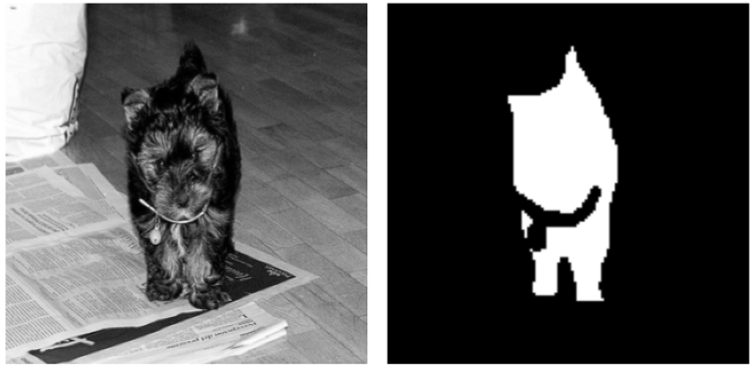 | 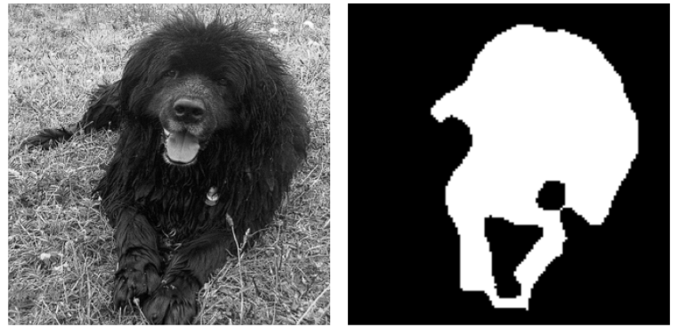 |

| Sample C | Sample D |
| :---: | :---: |
| 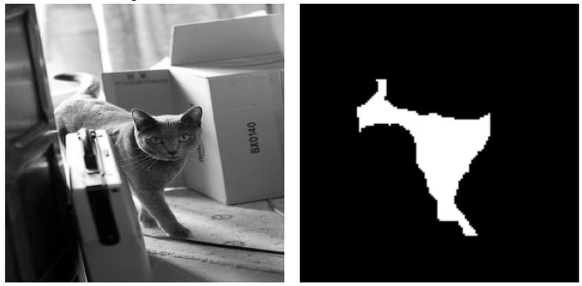 | 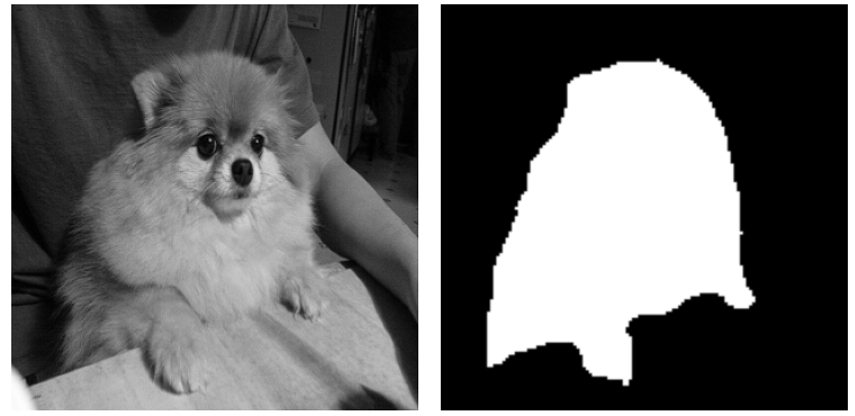 |

The U-Net architecture utilizes an encoder-decoder framework with dense skip connections to preserve high-frequency spatial features. Given a localized pixel-wise classification task, the model is optimized using multi-class Cross-Entropy Loss over the spatial domain.

## Optimization Objective

The objective function is the pixel-wise Cross-Entropy Loss computed over the final soft-max spatial feature maps:

$$\mathcal{L}_{\text{CE}}(\theta) = -\frac{1}{N} \sum_{i=1}^{N} \sum_{k=1}^{K} y_{i,k} \log\left(\hat{y}_{i,k}(\theta)\right)$$

Where $N$ represents the total number of pixels in the cropped output mask ($132 \times 132$), $K$ is the number of target classes, $y_{i,k}$ is the ground-truth binary indicator, and $\hat{y}_{i,k}$ is the predicted probability from the soft-max activation:

$$\hat{y}_{k}(x) = \frac{\exp(a_k(x))}{\sum_{k'=1}^{K} \exp(a_{k'}(x))}$$

---

## Evaluation Metrics

To evaluate generalization accuracy on highly localized segmentation boundaries, the following research-grade metrics are formulated over the prediction space:

### 1. Dice Coefficient (F1-Score)

Measures the spatial overlap between the predicted segmentations and the ground-truth masks:

$$\text{Dice} = \frac{2 \sum_{i=1}^{N} p_i g_i}{\sum_{i=1}^{N} p_i^2 + \sum_{i=1}^{N} g_i^2} = \frac{2 |P \cap G|}{|P| + |G|}$$

### 2. Intersection over Union (IoU / Jaccard Index)

Quantifies the intersection area divided by the total union area of the target boundaries:

$$\text{IoU} = \frac{\sum_{i=1}^{N} p_i g_i}{\sum_{i=1}^{N} p_i + \sum_{i=1}^{N} g_i - \sum_{i=1}^{N} p_i g_i} = \frac{|P \cap G|}{|P| \cup |G|}$$

Where $p_i \in P$ is the predicted binary pixel classification and $g_i \in G$ is the true target mask pixel value.

---

# U-Net-Paper-PyTorch-Implementation

This repository implements the original, classical U-Net architecture proposed in the foundational paper:

**U-Net: Convolutional Networks for Biomedical Image Segmentation** Paper: [https://arxiv.org/abs/1505.04597](https://arxiv.org/abs/1505.04597)

The project focuses on replicating the strict architectural design rules established by Ronneberger et al. entirely from scratch in PyTorch. This includes using **valid padding (padding=0)**, which yields cropped output segmentations relative to the input dimension, and excluding modern stabilization techniques such as Batch Normalization to evaluate the classical system's exact baseline dynamics.

## Technical Blog

I have documented the complete step-by-step implementation journey, mathematical breakdown of coordinate transformations, center-cropping mechanics, and segmentation optimization bottlenecks here:

[Building U-Net From Scratch While Reading the Paper](https://medium.com/@himanshusr451tehs/my-journey-of-implementing-u-net-from-scratch-765d78e33966)

The repository contains:

* Pure PyTorch implementation of the classical 2015 U-Net architecture.
* Strict valid-convolution processing pipeline (`padding=0`).
* Custom structural `ImageCropper` utility for matching contractive encoder maps with expanding decoder maps.
* Full training and evaluation loops optimized for pixel-wise tracking.
* High-fidelity tensor checking for complex shapes across contracting paths.

---

# Repository Objective

The primary objective of this implementation is to analyze:

* **Valid Convolution Spatial Dynamics**: Exploring the structural effects of unpadded convolutions on coordinate tracking and boundary inference.
* **Skip Connection Alignment**: Implementing rigorous center-cropping of high-resolution feature maps from the contracting path to concatenate them cleanly with upsampled tensors.
* **Classical Baseline Generalization**: Studying network convergence characteristics under strict spatial constraints without using Batch Normalization or structural shortcuts.

### Advanced Multi-Experiment Lab

This codebase represents the pristine, paper-exact baseline configuration. Advanced architectural modifications and extensions are tracked separately under individual experiment branches within the central research laboratory:

- **Advanced Variations**: [Generative Architectures Lab - U-Nets](https://github.com/Himanshu7921/generative-architectures-lab/blob/main/06_U-Nets/)

Experimental branches include implementations of:

* `Experiment-Tanh-BatchNorm-L2`: Stabilization variations utilizing weight decay ($L_2$ regularization) and structural batch normalizations.
* `Experiment-Dropout`: Adding stochastic regularizers within the deep bottleneck layers.
* `Experiment-Attention-Bottleneck`: Integrating soft-attention gating mechanisms along the skip connections.
* `Experiment-Residual-Connections`: Transforming standard block stacks into residual learning units.

---

# Dataset

Training was conducted on the **Oxford-IIIT Pet Dataset**. Due to strict hardware and compute constraints, the original paper's input configuration ($572 \times 572$) was structurally scaled down to a manageable spatial resolution of $316 \times 316$. Because the network relies entirely on valid padding, this yields an exact mathematically determined output mask size of $132 \times 132$.

Dataset characteristics:

| Property | Value |
| --- | --- |
| Dataset Target | Oxford-IIIT Pet Dataset |
| Target Type | Trimap Segmentation Masks |
| Input Channels | 1 (Grayscale Target Scaling) |
| Input Resolution ($H \times W$) | $316 \times 316$ pixels |
| Output Mask Resolution ($H \times W$) | $132 \times 132$ pixels (Mathematically cropped) |
| Total Segmentation Classes ($K$) | 2 (Binary Boundary Focus) |

---

# Training Results & Convergence Curves

The optimization progress over the 50-epoch training run shows steady convergence trends alongside sharp metric localization improvements. Performance is validated by metrics like accuracy, loss, dice coefficient, and IoU (Intersection Over Union), as well as a review of gradients.

Here are some of the key results and convergence curves from My U-Net model training:

| Objective Loss Journey | Intersection over Union (IoU) Progression |
| :---: | :---: |
| 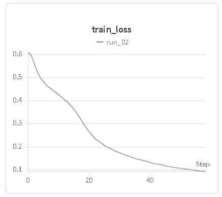 | 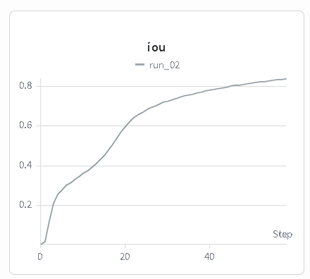 |

My loss curve shows a clear downward trend, indicating the model successfully minimized the objective function. Simultaneously, the IoU score progressively increases, demonstrating significant improvement in segmentation accuracy over time.

| Dice Coefficient Profile | Accuracy (mAP) Dynamics |
| :---: | :---: |
| 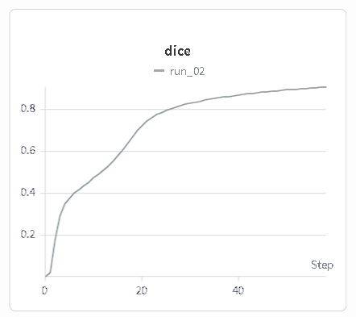 | 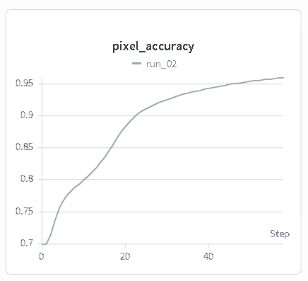 |

The Dice Coefficient increases with training, a crucial indicator of high-quality pixel-wise segmentation. The accuracy (mAP) dynamics further reinforce the model's consistent performance improvements across the test set.

| All Segmentation Gradients | Gradient Norm Flow Dynamics (Encoder) |
| :---: | :---: |
| 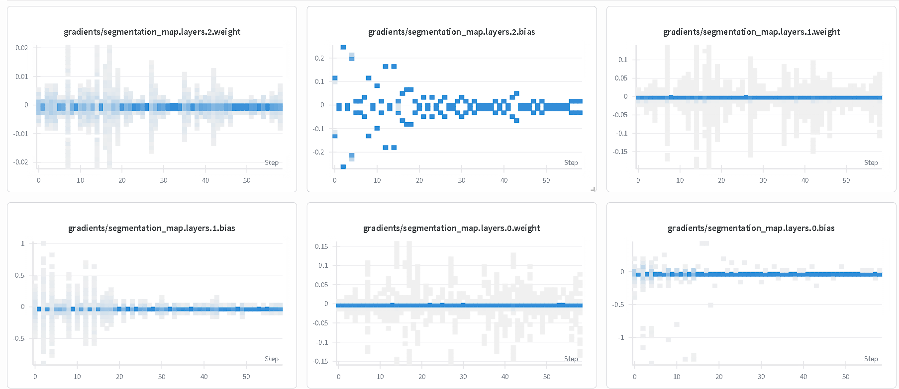 | 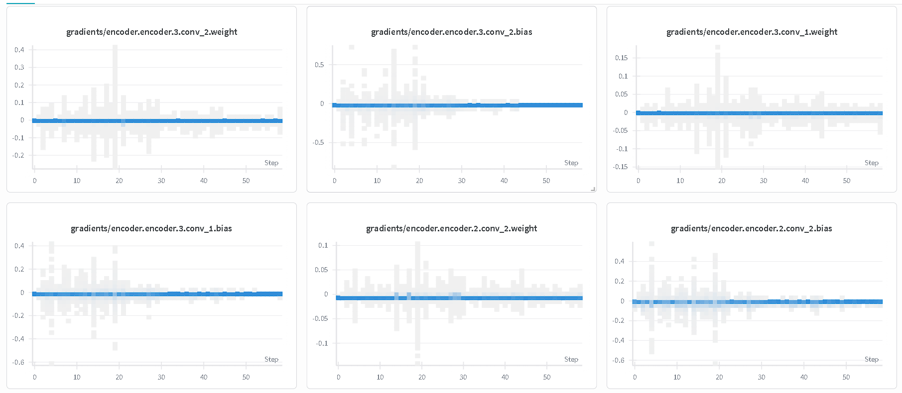 |

| Gradient Norm Flow Dynamics (Decoder) |
| :---: |
| 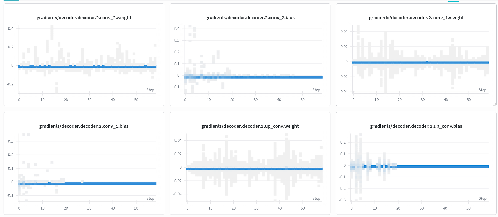 |

Analyzing the gradient norm flow is essential to ensure stable training and avoid problems like vanishing or exploding gradients. My gradient curves show healthy and bounded gradient flows for both the encoder and decoder, confirming the model's robust optimization process.

## Segmentation Mask Predictions

Below are validation samples demonstrating the network's capacity to localize target contours despite using unpadded boundaries:

The segmentation generations demonstrate:

* High spatial precision along interior structures.
* Expected boundary truncation artifacts near the limits of the $132 \times 132$ output frame due to the unpadded structure.
* Stable, non-vanishing gradient trends preserved entirely by the dense copy-and-paste skip connections.

---

# Architectural Design Principles

The configuration metrics trace the operational design space of the model exactly as formulated in the original paper:

| Design Choice | Paper Protocol Specs | Structural Implementation Mechanics |
| --- | --- | --- |
| **Valid Padding (`p=0`)** | Required | Causes step-wise spatial decreases ($H \rightarrow H-2 \rightarrow H-4$). |
| **No Batch Normalization** | Required | Relies entirely on precise weight initialization and learning rate scheduling. |
| **Skip Copy Connections** | Required | High-resolution maps are center-cropped to fit the decoder tensors. |
| **Upsampling Drive** | Required | Uses $2 \times 2$ Transposed Convolutions (`Up-Convolutions`). |
| **Segmentation Head** | Required | Uses a $1 \times 1$ Convolution to project features down to $K$ output channels. |

---

# Training Configuration

The hyperparameters listed below are loaded from the project's config engine during optimization:

| Hyperparameter Metric | Operational Assigned Value |
| --- | --- |
| **Initial Learning Rate ($\eta$)** | $1 \times 10^{-4}$ |
| **Optimization Routine** | Adam Optimizer |
| **Batch Sizing Constraint** | 1 (Online/Stochastic Scale Tracking) |
| **Target Epoch Lifecycle** | 50 Epochs |
| **Hardware Compute Device** | `cuda` (GPU Accelerated Execution) |
| **Encoder Target Depth Filters** | Layer-1 ($64$), Layer-2 ($128$), Layer-3 ($256$), Layer-4 ($512$) |
| **Deep Bottleneck Map Filter** | $1024$ Channels |

---

# Project Structure

```text
├── assets/                           # Stored evaluation curves, metrics, and gradient plots
├── checkpoints/                      # Localized training model checkpoints (.pth)
├── data/                             # Raw dataset directory (Oxford-IIIT Pet images & trimaps)
├── predictions/                      # Extracted output segmentation mask predictions
│
├── src/
│   ├── blocks.py                     # Generic/reusable neural network building blocks
│   ├── bottleneck.py                 # Deepest latent bridge layer separating encoder/decoder
│   ├── config.py                     # Centralized hyperparameter and training configuration
│   ├── decoder.py                    # Expanding path blocks with transposed convolutions
│   ├── encoder.py                    # Contracting path blocks with downsampling max-pooling
│   ├── generate_segmentation.py      # Inference script to output final segmentation masks
│   ├── imagecropper.py               # Center-cropping logic for skip connection tensor matching
│   ├── model.py                      # Core structural assembly combining all sub-modules
│   ├── segmentation.py               # Final 1x1 convolution projection head to class space
│   ├── skipconnections.py            # Feature concatenation logic along the copy-and-paste lanes
│   ├── train.py                      # Main optimization loop and training pipeline execution
│   └── utils.py                      # Helper utilities (metric tracking, logging, saving plots)
│
├── .gitignore                        # Standard tracking exclusions (data, weights, caches)
└── README.md                         # Comprehensive project documentation
```

---

# Running Training

Clone the repository:

```bash
git clone https://github.com/Himanshu7921/U-Net-Paper-PyTorch-Implementation.git
cd U-Net-Paper-PyTorch-Implementation
```

Install dependencies:

```bash
pip install -r requirements.txt
```

Execute the training script:

```bash
python src/train.py

```

---

# References

1. Ronneberger, O., Fischer, P., & Brox, T. (2015). *U-Net: Convolutional Networks for Biomedical Image Segmentation*. Medical Image Computing and Computer-Assisted Intervention (MICCAI), Springer, LNCS, Vol. 9351, pp. 234--241. [https://arxiv.org/abs/1505.04597](https://arxiv.org/abs/1505.04597)

---

# Author

Himanshu Singh | Deep Learning Research Engineer 2026